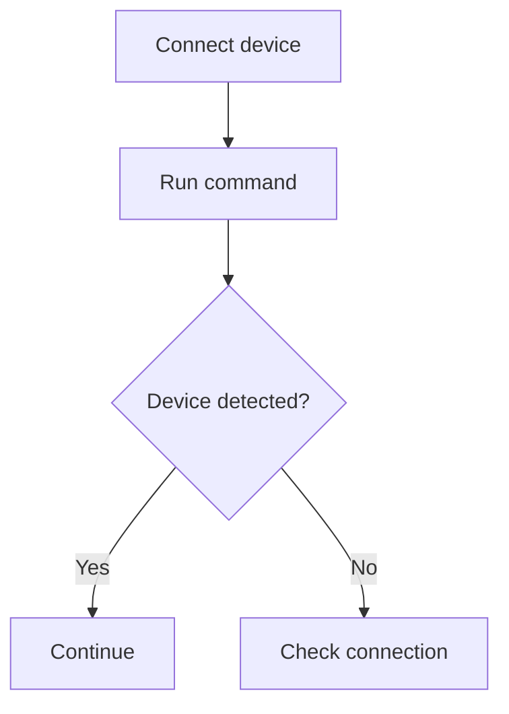

# GitHub Markdown Reference for Electronic Cats Documentation

<!-- markdownlint-disable MD024 -->

## 1. Purpose

This document defines how Markdown should be written for Electronic Cats documentation that will be published as GitHub Wiki pages and Markdown files.

The standard is based on **GitHub Flavored Markdown (GFM)** and GitHub's current Markdown rendering behavior.

Use this document as a practical reference. It is not intended to document every feature supported by Markdown or GitHub.

GitHub supports Markdown in wiki pages and provides GitHub-specific formatting features such as task lists, alerts, section links, relative links, and rendered diagrams.

---

## 2. General Rules

### Use GitHub Flavored Markdown

Documentation should use standard Markdown/GFM syntax that renders correctly on GitHub.

Prefer Markdown syntax over unnecessary HTML.

#### Keep Markdown readable in source

The `.md` file should be easy to read and edit before it is rendered.

Use:

- Clear spacing between sections.
- Consistent indentation.
- Consistent list syntax.
- Consistent code fences.
- Descriptive link text.
- Descriptive image alt text.

#### Prefer maintainable Markdown

When linking to files or pages inside the same repository or documentation set, prefer relative links when appropriate.

---

## 3. Headings

Use Markdown headings to define the document hierarchy.

```markdown
# Page Title

## Main Section

### Subsection

#### Sub-subsection
```

### Rules

- Use exactly one `#` heading for the page title.
- Use `##` for main sections.
- Use `###` for subsections.
- Use `####` only when another level is genuinely necessary.
- Do not skip heading levels without a clear reason.
- Do not use headings only to make text larger.
- Keep headings concise and descriptive.

GitHub automatically creates an outline from headings in rendered Markdown files. This makes heading structure especially important for long pages such as `Understanding [Product]`.

---

## 4. Paragraphs and Line Breaks

Separate paragraphs with a blank line.

```markdown
The CatSniffer is a wireless protocol analysis tool.

It can be used to capture and analyze supported protocols.
```

Do not use multiple empty lines to create visual spacing.

For normal documentation, prefer separate paragraphs instead of manual line breaks.

---

## 5. Text Emphasis

### Bold

Use bold for important information.

```markdown
The device requires **3.3 V**.
```

Use it sparingly.

### Italic

Use italics when emphasis is useful.

```markdown
This option is *optional*.
```

### Strikethrough

Generally avoid strikethrough in published product documentation unless documenting a deprecated or intentionally removed item.

```markdown
~~Deprecated command~~
```

---

## 6. Lists

### Unordered Lists

Use unordered lists for independent items such as requirements or features.

```markdown
- Minino board
- USB-C cable
- Computer
- Firmware package
```

### Ordered Lists

Use ordered lists when order matters.

```markdown
1. Connect the board.
2. Open the terminal.
3. Run the command.
4. Verify the result.
```

### Nested Lists

Use indentation for nested information.

```markdown
- Hardware
  - Minino
  - USB cable
- Software
  - Catnip
  - Firmware package
```

#### Rule

Use:

- `-` for independent items.
- Numbered lists for sequential actions.

---

## 7. Inline Code

Use backticks for technical terms that appear inside normal text.

Use inline code for:

- Commands.
- Parameters.
- Options.
- File names.
- Directories.
- Variables.
- Pin names.
- Tool names when the exact identifier matters.
- Version values.

Example:

```markdown
Run the `catnip devices` command.

Edit the `config.yaml` file.

Use GPIO `3`.
```

Do not use quotation marks for technical identifiers when inline code is more appropriate.

---

## 8. Code Blocks

Use fenced code blocks for commands, source code, configuration, and terminal output.

### Commands

Always specify the language when possible.

````markdown
```bash
catnip devices
```
````

### Python

````markdown
```python
print("Hello")
```
````

### C/C++

````markdown
```cpp
digitalWrite(LED_BUILTIN, HIGH);
```
````

### Configuration

````markdown
```yaml
port: COM5
baudrate: 115200
```
````

### Terminal Output

Use `text` for output that is not source code.

````markdown
```text
Device detected: CatSniffer
Firmware: 1.2.0
```
````

GitHub supports syntax highlighting for fenced code blocks using language identifiers.

---

## 9. Commands and Output

Commands and their output must be visually distinguishable.

Recommended pattern:

````markdown
Run:

```bash
catnip devices
```

Expected output:

```text
Device detected: CatSniffer
Firmware: 1.2.0
```
````

This confirms that the device was detected successfully.

Never make expected output look like a command the user should enter.

---

## 10. Tables

Use Markdown tables for structured information.

### Example

```markdown
| Parameter | Type | Required | Description |
|---|---|---|---|
| `port` | String | Yes | Serial port used by the device |
| `baudrate` | Integer | No | Communication speed |
```

### Good uses

Tables are useful for:

- Specifications.
- Pinouts.
- Parameters.
- Command options.
- Compatibility.
- Status codes.
- Feature comparisons.

### Avoid

Do not use tables for:

- Long paragraphs.
- Complete tutorials.
- Multi-step procedures.
- Large amounts of narrative text.

Keep table cells concise.

---

## 11. Links

Use standard Markdown links.

```markdown
[Getting Started](../getting-started.md)
```

For external resources:

```markdown
[Electronic Cats GitHub](https://github.com/ElectronicCats)
```

### Link Text

Use descriptive link text.

Prefer:

```markdown
[Read the firmware update guide](...)
```

Avoid:

```markdown
[Click here](...)
```

---

## 12. Relative Links

Prefer relative links for pages and files that belong to the same repository or documentation set when the link structure allows it.

Examples:

```markdown
[Hardware](../hardware.md)

[Getting Started](./getting-started.md)

[Pinout](../hardware/pinout.md)
```

For GitHub Wiki pages, follow the actual wiki page/link structure consistently.

---

## 13. Section Links

GitHub automatically creates anchors for headings.

For example:

```markdown
### Firmware Update
```

can be linked as:

```markdown
[Firmware Update](#firmware-update)
```

Use section links when they make navigation easier inside a long page.

---

## 14. Images

Use Markdown image syntax:

```markdown

```

### Rules

- Always provide useful alt text.
- Use descriptive file names.
- Prefer relative image paths for images stored with the documentation.
- Place images near the content they explain.
- Avoid decorative images that do not provide documentation value.

---

## 15. Image Alt Text

Alt text should describe the useful information contained in the image.

Good:

```markdown

```

Bad:

```markdown

```

---

## 16. GitHub Alerts

GitHub supports special blockquote alerts for documentation.

### Note

```markdown
> [!NOTE]
> Additional information that may help the user.
```

### Tip

```markdown
> [!TIP]
> A useful recommendation or shortcut.
```

### Important

```markdown
> [!IMPORTANT]
> Information that is necessary for successful completion.
```

### Warning

```markdown
> [!WARNING]
> Information about a situation that may cause problems.
```

### Caution

```markdown
> [!CAUTION]
> Information about a potentially dangerous or irreversible action.
```

#### Usage Rules

| Alert | Use for |
| --- | --- |
| `NOTE` | Additional context |
| `TIP` | Useful recommendation |
| `IMPORTANT` | Required information |
| `WARNING` | Possible problems or damage |
| `CAUTION` | Risky or potentially irreversible action |

Do not turn normal instructions into alerts.

---

## 17. Task Lists

GitHub supports task lists.

```markdown
- [ ] Connect the device.
- [ ] Install Catnip.
- [ ] Update the firmware.
- [x] Verify the device connection.
```

### Documentation Rule

Use task lists only when the user genuinely needs to track completion.

Do not use task-list syntax simply to create bullet points.

---

## 18. Blockquotes

Use blockquotes for quoted information or short contextual statements.

```markdown
> This firmware version is required for this feature.
```

For notes, warnings, and important information, prefer GitHub Alerts.

---

## 19. Horizontal Rules

Use `---` only when a strong visual separation between major parts of a page is useful.

```markdown
---
```

Do not use horizontal rules as a substitute for headings.

---

## 20. Mermaid Diagrams

GitHub supports Mermaid diagrams in Markdown files and Wikis.

Use a fenced code block with `mermaid`:

````markdown

````

Use diagrams only when they communicate a relationship or process more clearly than normal text.

Good uses:

- Hardware data flow.
- Software workflow.
- Communication flow.
- Decision trees.
- Process diagrams.

Do not replace simple text instructions with diagrams when the diagram adds unnecessary complexity.

---

## 21. Mathematical Expressions

GitHub supports rendered mathematical expressions in Markdown.

Use them only when mathematical notation is genuinely required.

Example:

```markdown
$V = I R$
```

Do not use mathematical formatting for ordinary values that can be written as normal text.

---

## 22. Collapsible Sections

GitHub supports HTML `<details>` / `<summary>` elements for collapsible content.

Example:

````html
<details>
<summary>Advanced options</summary>

Additional information goes here.

```bash
advanced-command
```

</details>
````

### Rules

Use collapsible sections sparingly.

Good uses:

- Advanced configuration.
- Optional technical details.
- Long command output.
- Additional information that beginners do not need immediately.

Do not hide essential instructions inside collapsible sections.

---

## 23. Footnotes

GitHub supports footnotes.

Example:

```markdown
This feature was introduced in firmware 1.2.0.[^1]

[^1]: Firmware 1.2.0 introduced support for this feature.
```

For Electronic Cats documentation, prefer normal inline explanations or links when possible.

Use footnotes only when a note would interrupt the main flow.

---

## 24. Comments

HTML comments can be used to keep internal notes out of the rendered page.

```markdown
<!-- TODO: Add image after the hardware revision is confirmed. -->
```

Use comments only for internal authoring notes.

Do not use comments to store important user-facing documentation.

---

## 25. Escaping Markdown Characters

Use a backslash when Markdown characters must appear literally.

Example:

```markdown
\*not italic\*
```

Use escaping only when necessary.

---

## 26. File and Directory Names

Use inline code for technical paths:

```markdown
Edit `config.yaml`.

The image is stored in `images/minino-board.png`.
```

When linking to actual repository files, prefer Markdown links:

```markdown
See [`config.yaml`](../config.yaml).
```

---

## 27. Versions and Compatibility

Use tables when several versions need to be compared.

```markdown
| Hardware | Firmware | Status | Notes |
|---|---|---|---|
| V1 | 1.x | Supported | Limited features |
| V2 | 2.x | Supported | Recommended |
| V3 | 3.x | Supported | Full support |
```

Use inline code for specific versions:

```markdown
This feature requires firmware `1.2.0` or later.
```

---

## 28. CLI and Reference Pages

Use a consistent pattern for command references.

````markdown
## `devices`

Lists the devices currently detected by the tool.

### Syntax

```bash
catnip devices [OPTIONS]
```

## Options

| Option | Type | Description |
| --- | --- | --- |
| `--port` | String | Serial port to use |
| `--verbose` | Flag | Enables detailed output |

### Example

```bash
catnip devices --port COM5
```

### Expected Output

```text
Device detected: Minino
Port: COM5
```
````

This format keeps command references easy to scan.

---

## 29. Procedures

Use the following pattern:

````markdown
### Step 1 — Connect the device

Connect the device to your computer using a USB cable.

Run:

```bash
catnip devices
```

Expected output:

```text
Device detected: CatSniffer
```

> [!NOTE]
> If the device is not detected, see the troubleshooting section.
````

A user should always be able to distinguish:

```text
Instruction
↓
Command
↓
Output
↓
Expected result
↓
Additional note
```

---

## 30. Specifications

Use tables for compact structured data.

```markdown
## Specifications

| Parameter | Value |
|---|---|
| Operating Voltage | 3.3 V |
| USB | USB-C |
| MCU | ESP32-C6 |
| Operating Temperature | -20 °C to 60 °C |
```

Avoid writing the same information as a long sequence of sentences.

---

## 31. Pinouts

Use tables for pinout information.

```markdown
## Pinout

| Pin | Function | Description |
|---|---|---|
| `3V3` | Power | 3.3 V supply |
| `GND` | Ground | Ground reference |
| `GPIO0` | Digital I/O | General-purpose I/O |
```

Use inline code for exact pin names.

---

## 32. What to Avoid

Do not:

- Use inconsistent heading levels.
- Use huge paragraphs when lists or tables are clearer.
- Use tables for narrative text.
- Put commands in normal paragraphs.
- Mix commands and command output in one code block.
- Use vague link text such as `Click here`.
- Use unnecessary absolute repository URLs when a relative link is appropriate.
- Add decorative images that do not help the user.
- Hide required instructions inside `<details>`.
- Use alerts for ordinary information.
- Create headings only to change text size.
- Use HTML when standard Markdown is enough.
- Overuse bold, italics, emojis, or visual effects.
- Duplicate long procedures across multiple pages.

---

## 33. GitHub-Specific Features: Use Carefully

GitHub supports features beyond basic Markdown, but the documentation standard should not use every available feature simply because it exists.

### Recommended

- Headings.
- Paragraphs.
- Lists.
- Tables.
- Code blocks.
- Relative links.
- Images.
- GitHub Alerts.
- Mermaid diagrams when useful.

#### Use only when justified

- Task lists.
- `<details>` sections.
- Footnotes.
- Mathematical expressions.
- Custom HTML.
- Other advanced GitHub-specific syntax.

Prefer the simplest structure that communicates the information clearly.

---

## 34. Compatibility Principle

Prefer GitHub-supported Markdown/GFM features over platform-specific syntax that may fail elsewhere.

If a feature is not necessary, prefer standard Markdown.

This makes the documentation easier to maintain, review, clone, and reuse.

---

## 35. Final Markdown Checklist

Before publishing a Markdown page, verify:

```text
[ ] The page has one # title.
[ ] Heading levels are hierarchical.
[ ] The document is easy to navigate using GitHub's outline.
[ ] Paragraphs are short and readable.
[ ] Lists are used appropriately.
[ ] Tables are used for structured information.
[ ] Commands use fenced code blocks.
[ ] Command output is clearly separated from commands.
[ ] Technical identifiers use inline code.
[ ] Links use descriptive text.
[ ] Internal links use relative paths when appropriate.
[ ] Images use meaningful alt text.
[ ] GitHub Alerts are used only when justified.
[ ] Mermaid is used only when a diagram adds value.
[ ] Essential instructions are not hidden in collapsible sections.
[ ] No unnecessary HTML is used.
[ ] Markdown renders correctly in GitHub.
```

---

## 36. Guiding Principle

> **Write Markdown for GitHub users, not just for Markdown parsers.**

The final document should be easy to:

1. Read.
2. Navigate.
3. Copy commands from.
4. Understand technical information from.
5. Verify results from.
6. Maintain in a Git repository.
7. Review through GitHub.
